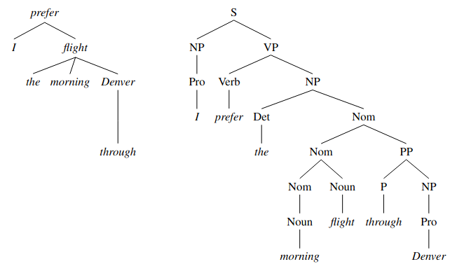

# Tutorial: Fundamentals

Before looking into Grex, we need to understand what it can be used for, that is, what are the grammar rules it can extract from treebanks? We first give a very brief overview of what syntactic dependencies are, and then we will formalise a grammar rule.

## Dependency Treebanks

A treebank is a set of sentences associated with linguistic annotations in the form of syntactic trees.

There are two main tree families of linguistic trees: **dependency trees** (left) and **constituency trees** (right):



*Trees from Daniel Jurafsky and James H. Martin. 2025. Speech and Language Processing: An Introduction to Natural Language Processing, Computational Linguistics, and Speech Recognition with Language Models, 3rd edition. Online manuscript released January 12, 2025. https://web.stanford.edu/~jurafsky/slp3.*


Grex *currently* works with dependency trees and requires them to be encoded in the **conllu data format**.
This format stores data in a column structured text file where sentences are separated by (at least one) empty line.
A sentence may contain metadata which can be used by Grex (e.g. to indicate the origin of the sentence, the language, etc.).

Below is an example of a treebank encoded in a conllu format containing two sentences:

```
# sent_id = GUM_vlog_pizzeria-42
# s_prominence = 4
# s_type = decl
# transition = null
# speaker = Giuliana
# addressee = MrsPellegrino,Nonna
# text = That's great!
1-2	That's	_	_	_	_	_	_	_	_
1	That	that	PRON	DT	Number=Sing|PronType=Dem	3	nsubj	_	Discourse=restatement-repetition_m:55->54:0:_|Entity=(44-event-giv:inact-cf1-1-coref)
2	's	be	AUX	VBZ	Mood=Ind|Number=Sing|Person=3|Tense=Pres|VerbForm=Fin	3	cop	_	_
3	great	great	ADJ	JJ	Degree=Pos	0	root	_	SpaceAfter=No
4	!	!	PUNCT	.	_	3	punct	_	_

# sent_id = GUM_fiction_falling-56
# s_prominence = 3
# s_type = q
# transition = zero
# speaker = Derya
# text = Got it?”
1	Got	get	VERB	VBN	Tense=Past|VerbForm=Part	0	root	_	Cxn=Interrogative-Polar-Direct|CxnElt=1:Interrogative-Polar-Direct.Clause|Discourse=restatement-partial:105->101:2:_
2	it	it	PRON	PRP	Case=Acc|Gender=Neut|Number=Sing|Person=3|PronType=Prs	1	obj	_	SpaceAfter=No
3	?	?	PUNCT	.	_	1	punct	_	SpaceAfter=No

```
Lines starting with # are comments.
However, when placed right before a sentence, they encode metadata.

Grex does not make any assumptions about how you store your data: you can have the full treebank in a single file, or split it across multiple files.
Note, however, that Grex uses [Grew](https://grew.fr/) as a backbone, which can be slow when reading very large files.
We therefore recommend splitting very large treebanks into several conllu files.

## Grammar Rule Definition

A grammar rule defines a conditional relationship between three patterns. Since each pattern matches a specific set of occurrences in a corpus, the rule ultimately expresses a relationship between these sets of occurrences.

E.g. A linguistic question like *when are adjectives placed before their noun in French?* can be operationalised and answered using a corpus as follows.

Given all adjectives of nouns in a treebank (S for scope of the rule), we look for linguistic patterns or predictors (P) that favor the occurrence of pre-nominal adjectives (Q or conclusion), and we want to know to what extent this occurs (α) given a treebank.

We formalise and generalise this rule with a logical formula:


    S\implies (P\overset{\alpha\,\%}{\implies} Q)


Or using [Grew patterns](https://universal.grew.fr/?custom=67a7be8bead7b):

```
S: X[upos=NOUN]; Y[upos=ADJ]; X-[amod]->Y
P: X[NumType=Ord]
Q: Y << X
```

Pattern Q partitions the occurrences of S in two (Q or ¬Q). 

The rules can be interpreted probabilistically (in a frequentist interpretation): it is more likely that pre-nominal adjectives will be used when the adjectives are ordinals.

## Current limitations

### One rule at the time

Since rule extraction is implemented as a binary classification where the target variable *y* can take values either for Q or ¬Q, it is not possible to interrogate multiple variables (multiclass classification). Every question must be converted into a binary answerable question.

### Treebanks, yes! But what about other data?

Grex does not accept other types of data, like interlinear glosses (IGT) annotations, unless they are encoded according to the conllu format. However, IGT annotations usually do not include syntactic relations or dependencies. This means that it will not be possible to match occurrences based on their syntactic relations, but only on their order.