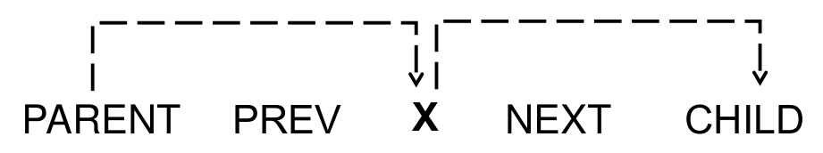

# Tutorial: Triggers

As we said, the triggers or predictors are filled by the selected ML model. However, the linguistic features included in the set of possible predictors are limited to a specific search space due to combinatorial or computational constraints.

The selected search space is selected in the yaml file (see [Extraction]( "Extraction"))

## Search space

For each node of the scope, node features within the following search space could be include or remove.



E.g. Given the following scope with two nodes binded (X and Y)

```grew
X[upos=NOUN]; Y[upos=ADJ]; X-[amod]->Y
```

For each of these nodes, we can add any feature encoded in the parent, previous, next, and the children nodes.

To note:
- A node can have several children, and we choose to encoded children's features are encoded as sets. Therefore, the inclusion of a children's feature should be interpreted as *there exists at least one child of X that has feature A*.
- Features are not included twice. E.g. if the parent node of Y is already defined in the scope, it will be not added again.

**In practice, the selection of features within the search space are defined in the YAML file.**


## But, How can you truly know which are the features?

TODO

## Degree

Predictors could be formed by a unique feature or by a combination of features.

A predictor could be:

- A feature node
    - e.g. X.parent.Number=Sing, for the parent of X has a the feature Number=Sing
    - e.g. X.rel_shallow=nsubj, for X is a subject
- A combination of features
    - e.g. X.parent.Number=Sing;X.rel_shallow=nsubj

The degree of the predictors is passed as an argument to Grex.